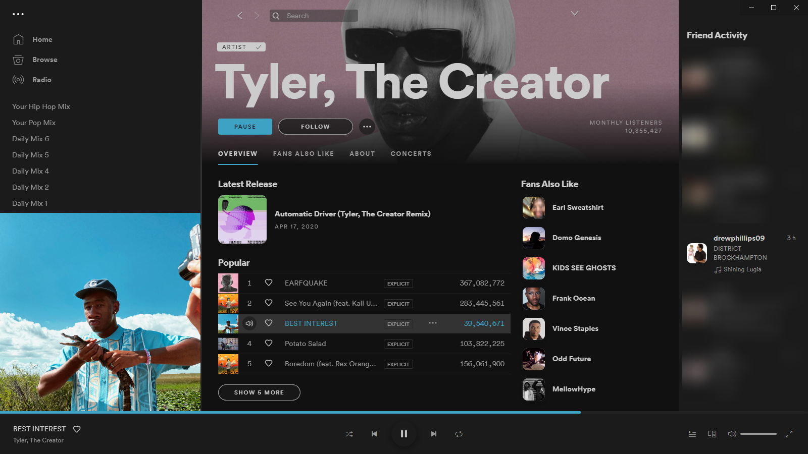
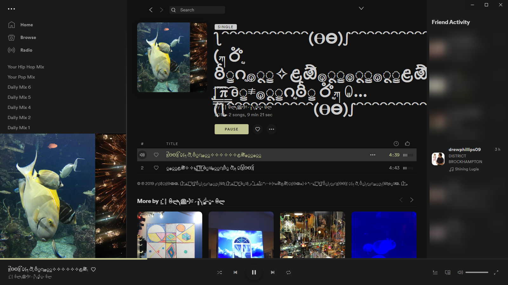
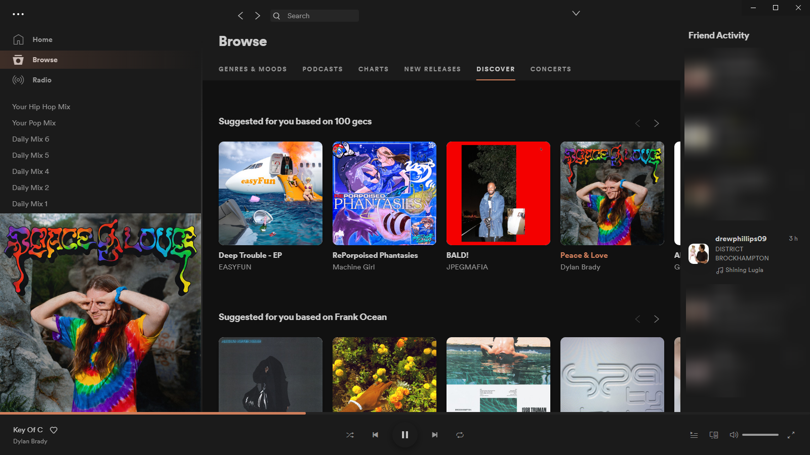

# dron
> Album art responsive Spicetify theme

I wanted the [Spicetify](https://github.com/khanhas/spicetify-cli) theme to react to the color of the album art. Spent like a week trying to get this to work. 

Theme based on [Nord](https://github.com/morpheusthewhite/spicetify-themes/tree/master/Nord) but I edited some greivances I had.

## To install:
1. Copy `Extentions` and `Themes` folders to your `.spicetify` directory
2. Run:
    - `spicetify config extensions dron.js`
    - `spicetify config extensions color-thief.umd.js`
    - `spicetify config current_theme dron`
    - `spicetify apply`

## Screenshots

Thanks to the [Color Thief](https://lokeshdhakar.com/projects/color-thief/) project for the color grabbing code.
